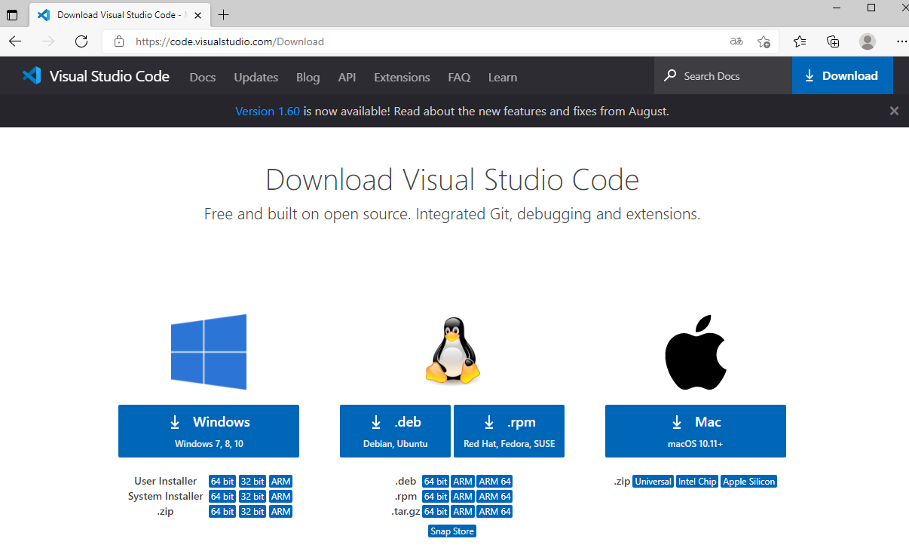
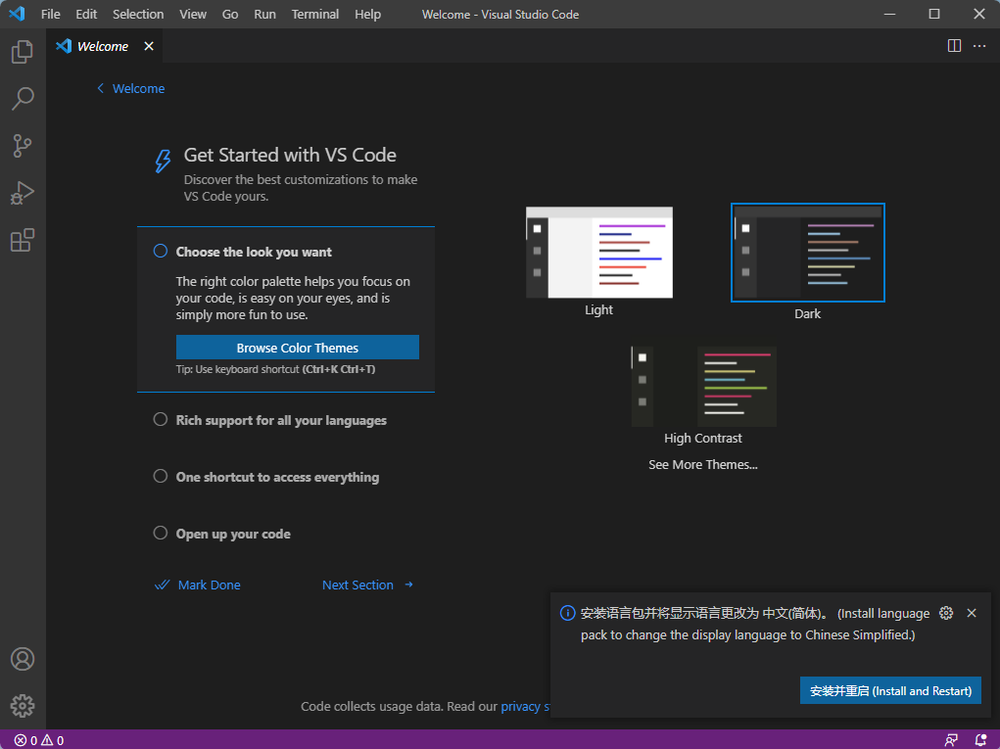
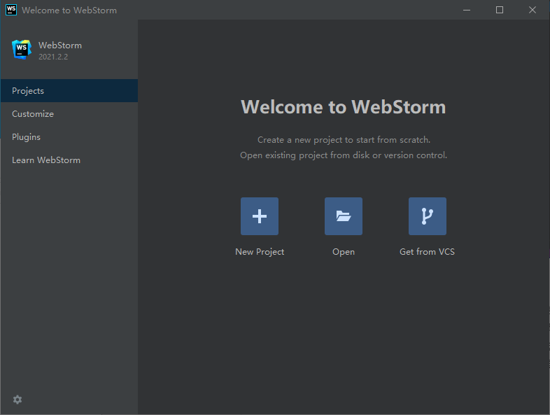
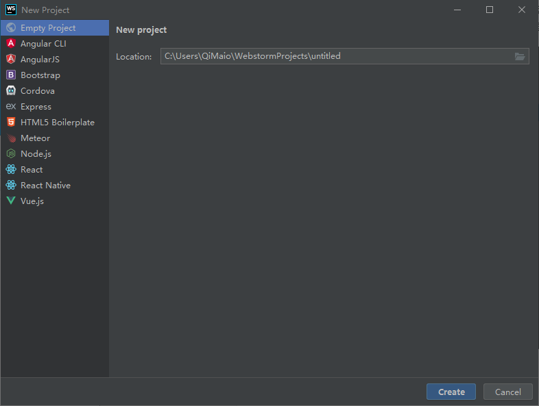
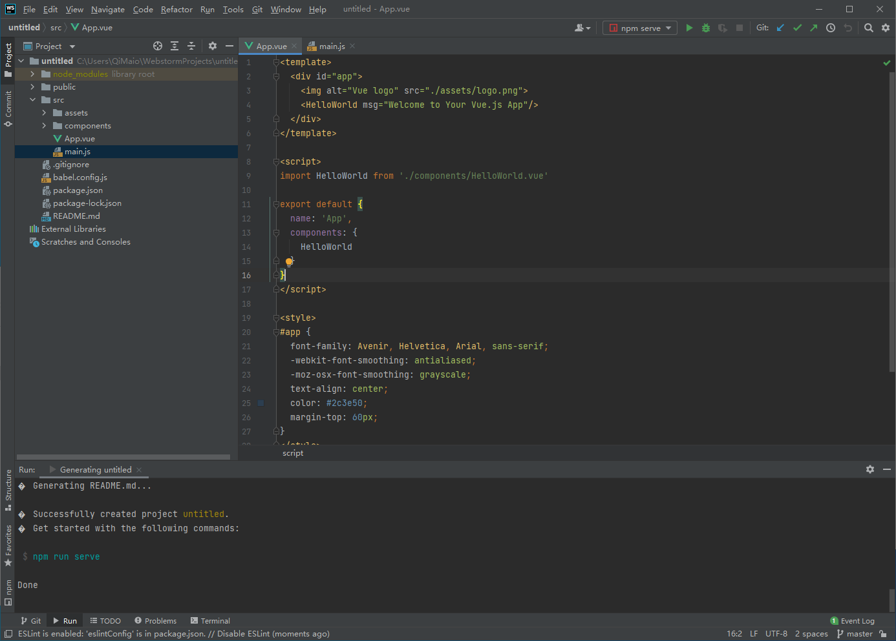
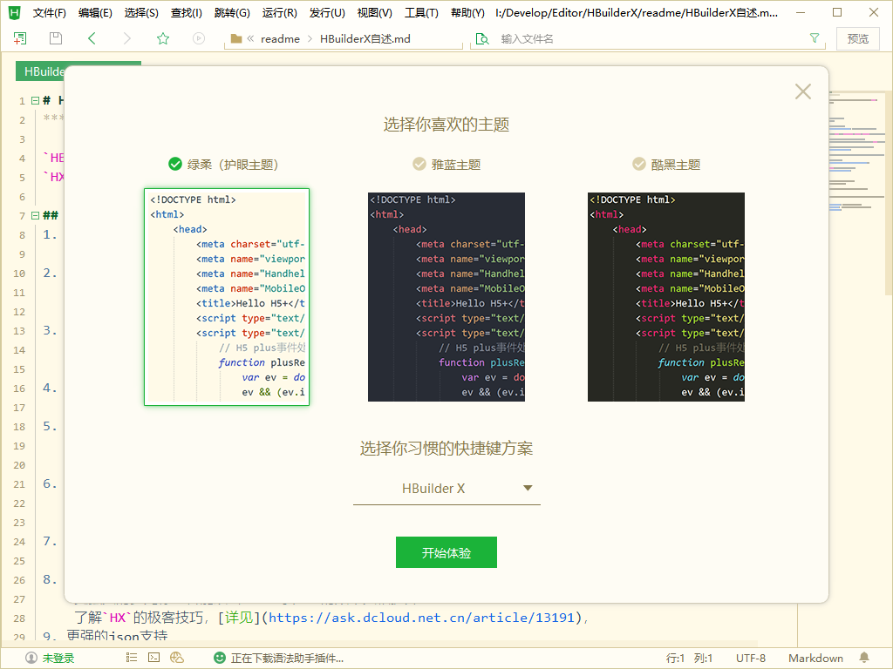
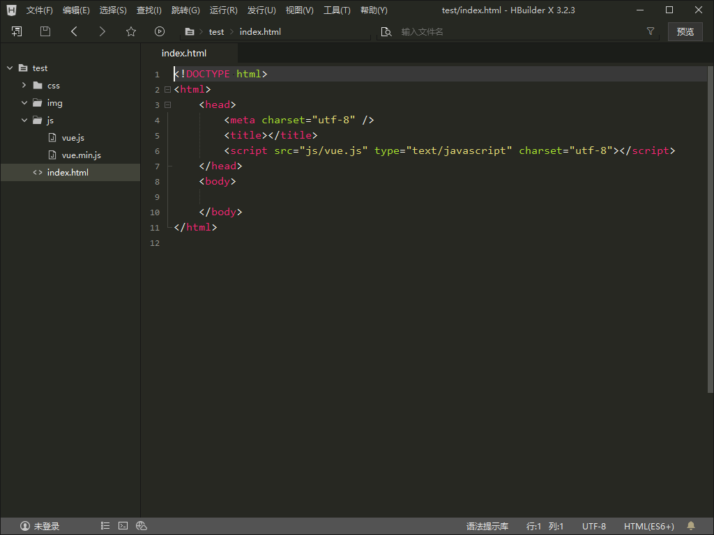

# Vue3初到新手村的神级装备
滴， 欢迎来到Vue.js3的世界， 来到Vue.js3的游戏世界， 希望你能尽早的通关。第一个新手任务请接收。让我们整理一下行装，开始用上你的设备， 开始准备改造自己的知识体系吧。
为什么需要编辑器。 当然记事本也可以编写代码，并且更能让你理解技术的来龙去脉，但有个高效工具， 不是更有时间早点下班， 陪家人， 陪孩子？对于编辑器的要求现在的时代， 代码版本管理， 语法高亮，代码自动补齐， 代码检查，代码调试等这些都要有吧， 毕竟不是单打独斗的时代了。
工欲善其事，必先利其器。 所以让我介绍几款不错的升级打怪套装。
## Visual Studio Code
微软出品，基于魔改的Electron开发， 免费，开源的新一代前端开发工具，以丰富的插件和全平台（Windows， macOS, Linux）的支持，迅速的被前端人员接受和使用。进行Vue3的学习，可以安装Vue.js的相关插件。关注我， 后续会有该内容的手把手的图解内容。  
官网： https://code.visualstudio.com/  
下载地址： https://code.visualstudio.com/Download  

主界面  

## WebStorm 
InterlliJ公司出品， 继续Web开发的神器。相当好用的编辑器， 使用过程中需要基本是开箱即用，省去自己找插件的过程， 但是有句老话说得好， 天上没有随便掉的馅饼， 开发软件也是，如果你觉得是馅饼， 可能只是别人的诱饵， 你不知道怎么上了当而已。就是好的东西获得都需要付出一些东西，该软件不免费。但是可以通过两种途径获得免费版本， 一种是： 你是学生，高中大学都可以， 然后提交你的身份信息， 可以获取免费凭证每年续签一次。第二种是开源或者在开源组织贡献过代码。也可以直接获得一年的全家桶凭证。当然你也可以30 天免费试用， 然后再来决定是否使用。  
官网： https://www.jetbrains.com/zh-cn/webstorm  
下载地址：https://www.jetbrains.com/zh-cn/webstorm/download/  

市面上的流行的框架基本上都原生支持了。 创建Vue项目也很方便
  
编辑器的主界面： 

## Hbuilder X
DCloud 数字天堂公司出品， 应该是国内最好用的编辑器了。 安装文件小，绿色文件，解压即用。 打开项目速度快， 专门为Vue.js做了一些定制， 面向开发者的一家公司。推荐使用。加上他们那套快捷键， 开发起来， 事半功倍。 官方介绍：轻如编辑器、强如IDE。基于C++开发。并且也兼容了部分VS Code的插件。现在为止有5000多款插件。  
官网地址： https://dcloud.net.cn   
下载地址： https://www.dcloud.io/hbuilderx.html 
 
可以选择不同的开发界面风格， 也可以选择不同的快捷方案。 用什么就使用什么快捷键更舒服一些。 当然也可以换成你之前习惯的快捷键， 但这是不会100%的还原快捷键， 总有那一个两个的有点水土不服。

我这选择了酷黑主题。 打开之后的效果为如下图:
 

上面三个个人主推的IDE编辑器， 当然还有Sublime, Vim， Atom， 等很多好用和我不知道的编辑器。这三个用好其中一个对于开发来说有效果的。后续使用VS Code进行开发和讲解所有知识点。当然你可以选择任何你喜欢的。 不强求。等觉得不顺手， 也没有找到解决方案的时候， 适当的变一变可能发现更好的。退一步再进一步才能海阔天空嘛。

本次Vue3升级打怪装备篇，先告一段落， 关注我， 后续继续讲解Vue3全家桶的所有内容。共同学习， 共同进步。每天进步一点点， 亿点点。

装备准备完成， 接下来我们来说说怎么使用Vue3。关注我， 可以继续主线任务。
