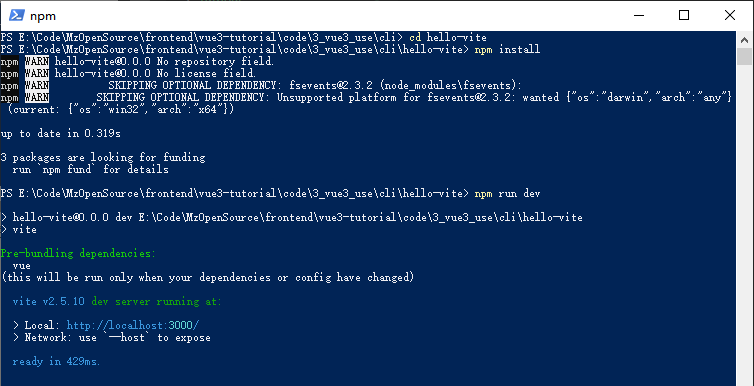

对于开发和学习任何一门新技术， 新框架， 最主要的还是能够运行起来， 怎么运行起来，这才是最主要的。所以， 我们来说一下 Vue.js 的安装方式。
因为 Vue.js 的设计初始，就是一个渐进式的 JavaScript 框架，所以你可以按需所用，这也就造就了他可以使用多种方式集成到一个项目中。
当前文档的最新版本为: 3.2.12  to 3.2.13
这里尽量在文档中使用的都是该版本， 没有大版本变化， 不再对内容进行更新。 本来使用 3.2.12 编写本次文章，但在本文章编写的过程中， 已经升级到 3.2.13， 本次教程也同步升级到 3.2.13

在应用使用 Vue.js 中一般有4种方式（也可以说是三种方式， 也可以说是五种方式）：  
1. 在页面上使用 CDN 包的形式导入
2. 下载 Vue.js 的 JavaScript 文件引用使用
3. 使用 npm 安装它
4. 使用官方的 CLI 来构建应用， 这个是现在前端工作流程中使用最多的方式。
5. 使用 Vite 构建工具， 进行构建应用     

接下来详细的讲解这几种方式。
## 1. 在页面上使用 CDN 包的形式导入
在一开始 WEB 开发的过程中， 我们总是需要在 html 页面中直接引入对应的 JavaScript 文件。 Vue.js 是一个渐进式的框架， 所以这种方式也可以使用： 
```
<script src="https://unpkg.com/vue@next"></script>
```
引入的代码如下所示， 为了界面效果代码进行了截图。所有的代码都会放到 github 中。
  
执行该文件可以看到这种方式我们引用了vue@next, vue@3.2.12, vue.global.js这三个文件。
效果图如下：  


在实际的生产环境下， 最好指定对应的具体版本信息， 这样可以避免一些版本升级遇到的问题和bug。
指定版本的方式为： 
```
<script src="https://unpkg.com/vue@3.2.12/dist/vue.global.js"></script>
```
对于指定版本的引入只会引入该文件自己。后续需要用到的文件将需要自己单独引用。所以对于这种方式使用全局的引用方式进行引入。

## 2.下载 Vue.js 的 JavaScript 文件引用使用 
第二种方法和第一种其实是一种方式， 一个是别人帮我们搭建好了，我们直接用，另外一个是我们下载需要的引用文件进行本地引用。在使用的方式上是一致的。
下载地址有两个：
```
https://cdn.jsdelivr.net/npm/vue@next/dist/
https://unpkg.com/browse/vue@3.2.12/dist/
```
我会把这个文件下载备份到 github 中， 可以查看最后的 github 地址，进行查阅。也可以继续翻阅该教程， 到第三步的时候， 使用npm 直接安装文件， 到时候 npm 构建工具会直接下载所有需要的文件到本地。
Vue.js 目录结构，如图：  

针对以上的文件这么多， 我们应该怎么选择其中的 JavaScript 文件进行引用呢？我们分为几种不同的情况进行说明。 
*prod.js 和 *.js 带有 prod 为生产环境的版本， 进行了代码压缩。不带的就是开发版本， 针对开发会有详细的提示信息。
使用 CDN 或没有构建工具
vue(.runtime).global(.prod).js
若要通过浏览器中的 `<script src="...">` 直接使用，使用过程中就需要暴露 Vue 全局。
浏览器内模板编译：
vue.global.js 是包含编译器和运行时的“完整”构建版本，因此它支持动态编译模板。
vue.runtime.global.js 只包含运行时，并且需要在构建步骤期间预编译模板。
内联所有 Vue 核心内部包——即：它是一个单独的文件，不依赖于其他文件。这意味着你必须导入此文件和此文件中的所有内容，以确保获得相同的代码实例。
包含硬编码的 prod/dev 分支，并且 prod 构建版本是预先压缩过的。将 *.prod.js 文件用于生产环境。
如果不使用 UMD(Universal Module Definition) 模块化规范构建项目， 使用 IIFEs(Immediately-Invoked Function Expressions) 立即执行函数（自执行匿名函数）构建则可以直接引用JavaScript文件即可。
vue(.runtime).esm-browser(.prod).js
用于通过原生 ES 模块导入使用 (在浏览器中通过 `<script type="module"> ` 来使用)。
与全局构建版本共享相同的运行时编译、依赖内联和硬编码的 prod/dev 行为。
使用构建工具
vue(.runtime).esm-bundler.js
用于 webpack，rollup 和 parcel 等构建工具。
留下 prod/dev 分支的 process.env.NODE_ENV 守卫语句 (必须由构建工具替换)。
不提供压缩版本 (打包后与其余代码一起压缩)。
import 依赖 (例如：@vue/runtime-core，@vue/runtime-compiler)
导入的依赖项也是 esm bundler 构建版本，并将依次导入其依赖项 (例如：@vue/runtime-core imports @vue/reactivity)。
这意味着你可以单独安装/导入这些依赖，而不会导致这些依赖项的不同实例，但你必须确保它们都为同一版本。
浏览器内模板编译：
vue.runtime.esm-bundler.js (默认) 仅运行时，并要求所有模板都要预先编译。这是构建工具的默认入口 (通过 package.json 中的 module 字段)，因为在使用构建工具时，模板通常是预先编译的 (例如：在 *.vue 文件中)。
vue.esm-bundler.js 包含运行时编译器。如果你使用了一个构建工具，但仍然想要运行时的模板编译 (例如，DOM 内 模板或通过内联 JavaScript 字符串的模板)，请使用这个文件。你需要配置你的构建工具，将 vue 设置为这个文件。
使用服务端渲染方式
vue.cjs(.prod).js
通过 require() 在 Node.js 服务器端渲染使用。
如果你将应用程序与带有 target: 'node' 的 webpack 打包在一起，并正确地将 vue 外部化，则将加载此文件。
dev/prod 文件是预构建的，但是会根据 process.env.NODE_ENV 自动加载相应的文件。
简单的来自官网的介绍， 具体的详细细节会在接下来的使用过， 共同体会和发现区别。 我们继续。

本地引用的方式直接修改引用地址即可： 
```
<script src="https://unpkg.com/vue@3.2.12/dist/vue.global.js"></script>
```
在页面上新建了一个目录vuejs. 然后引用地址之后为： 
```
<script src="vuejs/vue.global.js"></script>
```
因为这里下载的就是固定的版本， 就不需要进行版本的指定了。
代码截图为： 


效果图如下： 


3. 使用 npm 构建安装的方式
首先你需要先安装 Node.js, 并且可以使用 npm 指令。当然也可以使用 yarn。并且使用 Vue.js 构建大型应用时推荐使用 npm 安装的方式。需要注意的是， 国内使用 npm 会特别的慢， 可以使用国内源进行加速， 或者自己搭建 npm 的私服。
使用 node --version 和 npm --version 查看是否安装并且保证较新的版本。

然后可以使用 npm install 命令进行安装使用。
```
npm install vue@next
```

--save 是当前项目生效， 不加的话默认为全局生效。
从这里可以看到 npm 构建工具已经把我们需要的所有的相关的依赖都下载到了当前目录中。
Vue 还提供了编写单文件组件的配套工具。如果你想使用单文件组件，那么你还需要安装 @vue/compiler-sfc：
```
npm install -D @vue/compiler-sfc
```
除了 @vue/compiler-sfc 之外，你还需要为已选择的打包工具选择一个配套的单文件组件 loader 或 plugin。
大多数情况下， 我们更倾向于使用基于 webpack 的 Vue CLI 构建工具来创建一个最小化的Vue.js应用。
## 4. 使用 CLI 工具构建应用
CLI: command-line interface 命令行界面， 一般情况下是通过应用的内部接口, 来实现一些不需要操作界面也能完成的工作。 
对于 Vue3 这里使用 Vue-CLI 最新版本的 Vue CLI v4.5,  而且命令改为： @vue/cli  最新版本安装方式为： 
```
yarn global add @vue/cli 
npm install -g @vue/cli
```

npm 方式:  

yarn 方式：  


如果在当前项目中需要升级到最新版本， 可以使用命令 vue upgrade --next 进行升级，大版本不推荐这种方式进行升级。如果需要迁移大版本， 推荐参考迁移指南。

接下来就可以使用 Vue/CLI 进行构建应用了。
创建一个 hello world 应用
```
vue create hello-world
```

默认是 Vue2 的版本， 可以切换到 Vue3 的版本。然后点击回车。

进入到 hello-world 的工作目录中 
```
cd hello-world
```
并用 npm run  启动项目
```
npm run serve
```


打开浏览器使用 http://localhost:8080 进行访问，查看效果：

## 5. 使用 Vite 构建 Vue 应用
Vite 是一个 web 开发构建工具，由于其原生 ES 模块导入方式，可以实现闪电般的冷服务器启动。以及快速的进行热部署。
在终端命令中输入一下命令， 就可以使用 Vite 构建 Vue 项目。
使用 npm init 创建应用
npm 6.x 和 7.x 有不同之处。
npm 6.x
```
npm init vite@latest   <project-name>  --template vue
```

npm 7+，需要加上额外的双短横线
```
npm init vite@latest   <project-name>  -- --template vue
```
  
然后进入到 project 目录中， 特别尴尬，大佬竟然在凌晨3点提交了 Vue.js 的 3.2.13 版本， 导致 npm install 一直提示找不到对应的信息。 不怕技术牛逼的人， 就怕技术牛逼的人还在拼。找不到的原因是因为私服的存在， 有一定的延迟性， 没有办法及时的更新npm 依赖。解决办法是暂时的把私服或者加速关闭， 使用官方源进行 install 就可以了。
```
cd <project-name>  
npm install
npm run dev
```
  
打开浏览器查看效果：
  
使用 yarn 创建项目
```
yarn create vite <project-name> --template vue 
```
  
```
cd <project-name> 
yarn 
yarn dev
```
浏览器效果同上， 不在截图。

使用 pnpm 创建项目
```
pnpm dlx create-vite <project-name> --template vue 
```
  
```
cd <project-name>
pnpm install
pnpm run dev
```
  
浏览器查看效果和第一个效果一致， 不再截图。
pnpm 
pnpm 是一个新的构建方式，类似于 maven，把所有的依赖文件相对单独存放， 这样的好处是， 当你的依赖重复的时候， 不会在各自的应用中重复出现， 节省磁盘的空间和安装速度。使用 npm install -g pnpm 安装使用。具体可以查看 https://www.pnpm.cn/installation 。

多种使用方式已经描述完毕， 很多细节的知识点， 需要后续实际使用的过程中进行详细描述。 

如果学习到了一点点知识点， 就给我个关注，点赞吧，  关注不迷路，可以查看后续更多关于 Vue.js 的知识点。